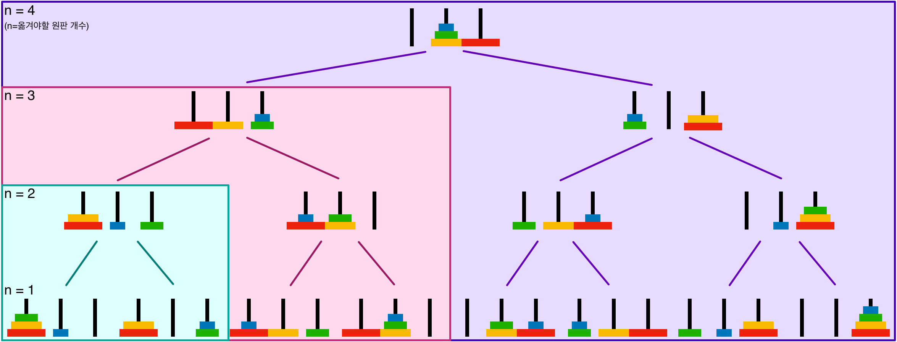

# 재귀: 10872, 10870, 2447, 11729

### [10872번: 팩토리얼](https://www.acmicpc.net/problem/10872)

알고리즘이 엉키기 쉽고, 디버깅이 쉽지 않기 때문에,
재귀로 푸는 습관보다는 DP(Memoization나 Bottom-Up) 방식이 더 좋다고 생각한다. 하지만, 재귀 영역에서 나온 문제 만큼은 재귀를 최대한 활용해보자는 마인드

제출 코드
```py
num = int(input())
def factorial(n):
    return 1 if n == 0 else n * factorial(n-1)

print(factorial(num))
```

<details>
<p>
    <summary>예제 입력</summary>

```py
10
```
</p>
</details>
<details>
<p>
    <summary>실행 결과</summary>

```py
3628800
```
</p>
</details>

---

### [10870번: 피보나치 수 5](https://www.acmicpc.net/problem/10870)

일반적인 재귀를 이용한 점화식 형태의 피보나치 구현
입력 범위가 20보다 작거나 같은 자연수로 작아서 시간 초과가 나지 않았다.

제출 코드
```py
def fibonacci(num):
    return num if num < 2 else fibonacci(num-1) + fibonacci(num-2)

print(fibonacci(int(input())))
```

<details>
<p>
    <summary>예제 입력</summary>

```py
10
```
</p>
</details>
<details>
<p>
    <summary>실행 결과</summary>

```py
55
```
</p>
</details>

---

### [2447번: 별 찍기 - 10](https://www.acmicpc.net/problem/2447)

fibonacci 재귀와 같이 출력을 전부 구한 뒤, 마지막에 return 받아서 한번에 출력하고 싶었지만, 각 줄의 끝을 조건으로 개행을 추가하는 방법이 떠오르지 않았다.

그래서 참조값을 넘겨주는 배열의 성질을 이용해서 함수 내에서 2차원 배열을 수정해주는 방식으로 구현했다. 처음에는 범위로 패턴을 확대 시키고 싶어서 리스트 slice() 후 곱하는 방식으로 구현을 했다가, 열 방향으로 범위를 취할 수 없었다.

최종적으로, 모든 원소를 방문하면서, 0~n의 범위를 삼등분(n//3)으로 방문하는 도중에,
x좌표와 y좌표가 모두 n//3 (3x3의 정중앙) 일 때, continue로 재귀 호출을 건너뛰는 방식으로 코드를 구현할 수 있었다.

제출 코드
```py
# 시작 좌표: (x, y) / 영역 크기: n
def drawStar(x, y, n):
    if n == 1:
        pattern[x][y] = '*'
    else:
        for i in range(0, n, n//3):
            for j in range(0, n, n//3):
                if i == n//3 and j == n//3:
                    continue
                drawStar(x+i, y+j, n//3)

num = int(input())
pattern = [[' '] * num for _ in range(num)]

drawStar(0, 0, num)

for p in pattern:
    print(''.join(p))
```

<details>
<p>
    <summary>예제 입력</summary>

```py
27
```
</p>
</details>
<details>
<p>
    <summary>실행 결과</summary>

```py
***************************
* ** ** ** ** ** ** ** ** *
***************************
***   ******   ******   ***
* *   * ** *   * ** *   * *
***   ******   ******   ***
***************************
* ** ** ** ** ** ** ** ** *
***************************
*********         *********
* ** ** *         * ** ** *
*********         *********
***   ***         ***   ***
* *   * *         * *   * *
***   ***         ***   ***
*********         *********
* ** ** *         * ** ** *
*********         *********
***************************
* ** ** ** ** ** ** ** ** *
***************************
***   ******   ******   ***
* *   * ** *   * ** *   * *
***   ******   ******   ***
***************************
* ** ** ** ** ** ** ** ** *
***************************
```
</p>
</details>

---

### [11729번: 하노이 탑 이동 순서](https://www.acmicpc.net/problem/11729)

*하노이의 탑*\
원판을 하나씩 밖에 움직이지 못하는 것과 큰 원판이 작은 원판 위에 올라가지 못하는 규칙에 의해,\
전체 탑을 옮기기 위해서는 옮기려는 위치는 비어 있고(1), 나머지 모든 원판들은 (규칙에 의해) 필연적으로 다른 위치에 차례대로 쌓여 있어야 한다. 여기서 가장 큰 원판이 없다는 가정하면, 처음 모든 원판이 놓여있을 때와 같은 상황이 발생하기 때문에 이러한 반복 작업에서 재귀 함수를 활용할 수 있다.

재귀 함수 (# 0 옮겨야할 원판이 n 이상일 경우)
1. (재귀): 가장 큰 원판(n-1)을 제외하고, 다른 원판들을 start에서 other로 이동
2. (작업): 큰 원판을 start에서 finish로 이동
3. (재귀): 가장 큰 원판(n-1)을 제외하고, 다른 원판들을 other에서 finsih로 이동

해당 재귀 함수를 그림으로 크게 풀면 다음과 같다.



제출 코드
```py
def hanoi(num, start, finish, other):
    if num > 0:                             # 0
        hanoi(num-1, start, other, finish)  # 1
        print(start, finish)                # 2
        hanoi(num-1, other, finish, start)  # 3

disks = int(input())

print(2 ** disks - 1)
hanoi(disks, 1, 3, 2)
```

<details>
<p>
    <summary>예제 입력</summary>

```py
3
```
</p>
</details>
<details>
<p>
    <summary>실행 결과</summary>

```py
7   # 원판 총합 7번 이동 (그림에서 n=3)
1 3 # 1에서 3으로 원판 이동
1 2
3 2
1 3
2 1
2 3
1 3
```
</p>
</details>
