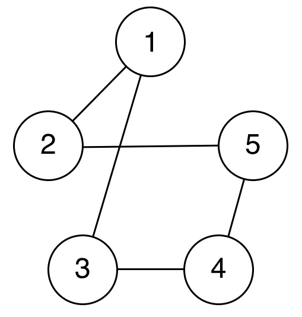

# [그래프] 인접 행렬, 인접 리스트, 그래프 탐색(DFS, BFS, 노드 간의 탐색)

그래프 관련 문제를 풀 때, 문제 상황을 그래프로 모델링하여 푸는 과정에서
노드 간의 연결 관계를 나타내기 위한 두 가지 방식
1. 인접 행렬
2. 인접 그래프

ps. 코드에서 사용되는 그래프는 서로 인접한 노드들을 나열한 input 값으로 가정

`ex)`

```py
numOfNodes = 6
data = [(1, 2), (1, 5), (2, 3), (2, 5), (3, 4), (4, 5), (4, 6)]
```


---

## 인접 행렬

그래프의 노드 간의 관계를 2차원 배열(Nested List)로 나타내는 방식

장점 😁
- 이미 알려진 두 노드 i, j 간의 관계를 탐색하는데 O(1) 시간 복잡도를 가진다\
ex) `graph[i][j] = 1 or 0`

단점 😡
- 특정 노드 i에 대하여 인접한 노드들을 탐색할 때는 O(N) 시간 복잡도를 가진다\
ex) `graph[i][1] ~ graph[i][N] 모두 확인`


```py
graph = [
    [0, 0, 0, 0, 0, 0, 0], # 0
    [0, 0, 1, 0, 0, 1, 0], # 1
    [0, 1, 0, 1, 0, 1, 0], # 2
    [0, 0, 1, 0, 1, 0, 0], # 3
    [0, 0, 0, 1, 0, 1, 1], # 4
    [0, 1, 1, 0, 1, 0, 0], # 5
    [0, 0, 0, 0, 1, 0, 0]  # 6
]
```
> 노드 i와 j 사이에 간선이 존재하면 graph[i][j] = 1, 아니면 0\
> *이때 가중치(n)가 있는 그래프라면, n으로 표시 가능*

*Python 구현*

```py
numOfNodes = 6
data = [(1, 2), (1, 5), (2, 3), (2, 5), (3, 4), (4, 5), (4, 6)]

graph = [[0] * (numOfNodes+1) for _ in range(numOfNodes+1)]

for node in data:
    graph[node[0]][node[1]] = 1
    graph[node[1]][node[0]] = 1
```

---

## 인접 그래프

그래프의 각 노드가 인접한 노드들을 원소로 가지는 배열로 나타내는 방식

장점 😁
- 이미 알려진 두 노드 i, j 간의 관계를 탐색하는데 O(1) 시간 복잡도를 가진다\
ex) `graph[i][j] = 1 or 0`

단점 😡
- 특정 노드 i에 대하여 인접한 노드들을 탐색할 때는 O(N) 시간 복잡도를 가진다\
ex) `graph[i][1] ~ graph[i][N] 모두 확인`


```py
graph = [
    [],         # 0
    [2, 5],     # 1
    [1, 3, 5],  # 2
    [2, 4],     # 3
    [3, 5, 6],  # 4
    [1, 2, 4],  # 5
    [4],        # 6
]
```

*Python 구현*

```py
numOfNodes = 6
data = [(1, 2), (1, 5), (2, 3), (2, 5), (3, 4), (4, 5), (4, 6)]

graph = [[] for _ in range(numOfNodes+1)]

for node in data:
    graph[node[0]].append(node[1])
    graph[node[1]].append(node[0])
```

---

## DFS & BFS 알고리즘

`ex)`



ps. 구현에 사용된 graph는 <u>인접 리스트</u> 형태이다

```py
node = 5    # 총 노드 개수
start = 3   # 탐색 시작 노드
graph = [ [], [2, 3], [1, 5], [1, 4], [3, 5], [2, 4] ]
```

## 깊이 우선 탐색, DFS(Depth First Search)

더 깊은 노드부터 우선적으로 탐색하는 알고리즘\
**Stack**이나 재귀 함수를 이용하여 구현한다

*Python 구현*

```py
visited = [False] * (node+1)

# Stack
def dfs_stack(graph, start):
    s = [start]
    while s:
        v = s.pop()
        visited[v] = True
        print(v, end=" ")
        for i in graph[v]:
            if not visited[i]:
                s.append(i)
                visited[i] = True

# Recursive(재귀)
def dfs_recursive(graph, v):
    visited[v] = True
    print(v, end=" ")
    for i in graph[v]:
        if not visited[i]:
            dfs(graph, i)
```

*실행 결과*

```py
Stack → 3 4 5 2 1   # Stack을 활용하여, 값이 반대로(큰 수 먼저) 방문 됨

Recersive → 3 1 2 5 4
```

## 너비 우선 탐색, BFS(Breadth First Search)

가까운 노드(같은 깊이)부터 우선적으로 탐색하는 알고리즘\
**Queue**를 이용하여 구현

*Python 구현*

```py
from collections import deque

visited = [False] * (node+1)

def bfs_queue(graph, start):
    q = deque([start])
    visited[start] = True
    while q:
        v = q.popleft()
        print(v, end=' ')
        for i in graph[v]:
            if not visited[i]:
                q.append(i)
                visited[i] = True
```

*실행 결과*

```py
Queue → 3 1 4 2 5
```

---

## 두 노드 간의 경로

두 노드 간의 탐색(DFS/BFS) 중 찾으려는 노드를 발견하게 되면, 그때까지 같이 저장해온 경로 리스트를 결과값으로 반환할 Paths에 추가하는 방식으로 최단거리 뿐만 아니라 모든 경로를 구할 수 있다.

`ex)`


```py
start = 1
end = 4     # 1부터 4까지의 모든 경로
```

*Python 구현*

```py
# DFS (Stack)
def dfs_paths(graph, start, end):
    paths = []
    s = [(start, [start])]
    while s:
        v, p = s.pop()
        if v == end:
            path.append(p) # return p <= 최단 경로 반환
        else:
            for i in graph[v]:
                if i not in p:
                    s.append((i, p + [i]))
    return paths

# BFS (Queue)
def bfs_queue(graph, start, end):
    paths = []
    q = deque()
    q.append((start, [start]))
    while q:
        v, p = q.popleft()
        if v == end:
            paths.append(p) # return p <= 최단 경로 반환
        for i in graph[v]:
            if i not in p:
                q.append((i, p + [i]))
    return paths
```
> 여기서 최단 경로 만 구하려면, 모든 간선의 가중치가 동일(1)이라는 가정 하에, target node를 찾으면, 바로 그때의 path를 반환하면 된다.

> 문제에 따라 가중치 부여 후 최종 paths에서 Max, Min 경로를 추출할 수 있다.

*실행 결과*

```py
DFS (Stack) -> [[1, 3, 4], [1, 2, 5, 4]]

BFS (Queue) -> [[1, 3, 4], [1, 2, 5, 4]]
```

---

## 참고 문헌
- [그래프 - 인접 행렬과 인접 리스트](https://keepdev.tistory.com/75)
- [[그래프] 인접 행렬과 인접 리스트](https://sarah950716.tistory.com/12#footnote_link_12_1)
