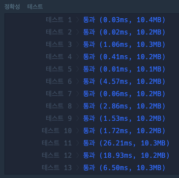
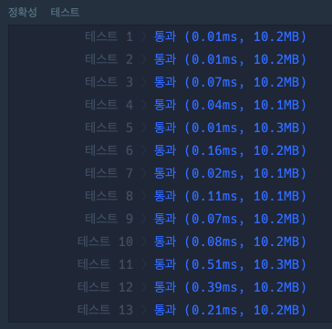

# [깊이/너비 우선 탐색(DFS/BFS)] 네크워크

문제 링크: https://programmers.co.kr/learn/courses/30/lessons/43162

최근에 정리한 [그래프 탐색](https://github.com/turquoiseluv/Today-Jason-Learned/blob/main/알고리즘/그래프-인접_행렬_&_그래프.md)을 활용해볼 수 있는 문제를 골라보았다.\
네트워크에 유효한 네트워크 그룹의 개수를 구하는 문제로, DFS/BFS 접근 전부 가능하다. stack은 탐색을 위하여 값이 계속 빠지므로, 최종적으로 구한 네트워크(경로)를 저장하기 위해 따로 path를 저장해야 한다.

<p align="center"></p>

#### 첫번째 코드: visited + path(list)로 구현
visited로 이미 탐색한 노드는 이미 탐색이 끝난 그룹에 속해있다는 의미이기 때문에, not visited인 노드들을 `for node in range(len(computers))`로 모든 노드를 출발점으로 전부 한번씩 탐색을 해주었다. 중복 제거를 통해 같은 그래프 관계가 나오지 않으므로, 탐색이 끝난 결과 path를 바로 network에 넣고 최종적으로 `len(network)`로 네트워크 그룹의 개수를 구한다.

#### 두번째 코드: path(set)으로 구현
visited를 지우고, path를 set 자료형으로 저장하여 마지막에 중복이 되지 않게 `if path in network`로 필터링을 해도 된다. 어짜피 각 노드 탐색의 마지막에 해당 노드의 path(네트워크)를 저장하기 위해 따로 지니고 있어야 하기 때문에 따로 visited 리스트를 사용할 필요가 없다.

**하지만**, 제출한 결과에서 테스트가 전반적으로 visited를 사용하지 않은 path가 너무 오래 걸렸다. 큰 네트워크면 노드마다 같은 경로(N)를 반환하고, 그외 다른 네트워크의 개수(M)도 많다면 마지막에 중복 체크하는 구간에서 시간 복잡도가 O(N*M)이기 때문이라 생각한다.

#### 최종 코드: path(boolean) + networkCount로 구현
1번의 시간 복잡도가 좋은 것을 보다가, 중복이 배제된 결과 path가 나오므로 이를 중복 처리할 필요가 없고, 고로, 아예 path를 저장할 필요도 없이 path가 시작되는지의 여부만 사용하여 네트워크 그룹의 개수를 반환할 수 있었다. 최종적으로 시간이 많이 개선된 것을 볼 수 있었다.

<p align="center">
    
    
    
    <i>실행 결과 (1st / 2nd / Final 순)</i>
</p>

(다른 풀이) while문으로 모든 노드 방문
그래프를 한번 돌고, 바뀐 visited값을 이용하여 탐색을 함수화 하고, 아직 방문하지 못한 노드들을 시작 노드로 잡고
탐색 함수를 다시 호출하여 모든 노드를 적어도 한번은 방문하는 방법도 가능하다.

```py
node = 0
    while 0 in visited:
        if visited[node] == 0:
            dfs(computers, visited, node)
            answer += 1
        node += 1
```

ps. 결과 접근 방법이 4가지에 그래프 탐색 기법까지 dfs/bfs 2가지... 그래프 문제는 풀이가 참 자유롭구나 @.@;;

---

### Python 구현

<details>
    <summary>첫번째 코드</summary>

```py
# 1st
def solution(n, computers):
    visited = [0] * n
    network = []
    for i in range(len(computers)):
        path = []
        stack = []
        if not visited[i]:
            stack.append(i)
            path.append(i)
            visited[i] = 1
        while stack:
            v = stack.pop()
            for i, link in enumerate(computers[v]):
                if link and not visited[i]:
                    stack.append(i)
                    path.append(i)
                    visited[i] = 1
        if path:
            network.append(path)
    return len(network)
```
</details>

<details>
    <summary>두번째 코드</summary>

```py
# 2nd
def solution(n, computers):
    network = []
    for node in range(len(computers)):
        path = set([])
        stack = []
        if node not in path:
            stack.append(node)
            path.add(node)
        while stack:
            v = stack.pop()
            for other, link in enumerate(computers[v]):
                if link and other not in path:
                    stack.append(other)
                    path.add(other)
        if path and path not in network:
            network.append(path)
    return len(network)
```
</details>

최종 코드

```py
n = 3
computers = [[1, 1, 0], [1, 1, 0], [0, 0, 1]]

# Final
def solution(n, computers):
    visited = [0] * n
    networkCount = 0
    for node in range(len(computers)):
        path = 0
        stack = []
        if not visited[node]:
            stack.append(node)
            visited[node] = 1
            path = True
        while stack:
            v = stack.pop()
            for other, link in enumerate(computers[v]):
                if link and not visited[other]:
                    stack.append(other)
                    visited[other] = 1
                    path = True
        if path:
            networkCount += 1
    return networkCount
```

실행 결과 (위 코드 모두 동일)

```py
2 # 네트워크 수
```
